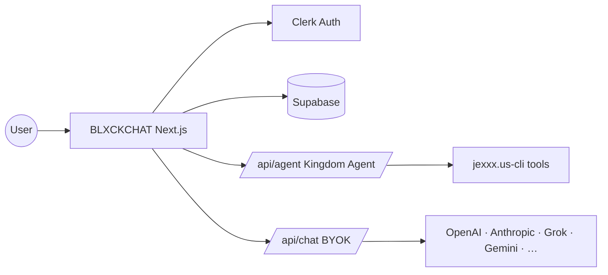

# BLXCKCHAT

[](https://blxckchat.jexxx.us)

> BYOK AI chat for the **JEXXXUS** ecosystem — private communion with cloud models, Kingdom Agent vault tools, and Divinity personas.

**Live:** [blxckchat.jexxx.us](https://blxckchat.jexxx.us)

## Overview

BLXCKCHAT is the web chat surface for the JEXXXUS Empire. Signed-in operators get **Kingdom Agent** parity with `jexxx.us-cli` (vault CRUD, VEIL/TV/Bible/Law tools). Guests and power users can bring their own API keys (BYOK) across OpenAI, Anthropic, Grok, Gemini, Kimi, Groq, OpenRouter, Hugging Face, and local inference (Ollama / Bonsai on HTTP localhost only).

Doctrine: *your keys, your vault, your communion.*

## Features

| Area | Capability |
|------|------------|
| **Kingdom Agent** | Clerk-scoped `/api/agent` + `/api/mini/agent` with JEXXXUS CLI tool registry (full vault CRUD including `phone`/`email` columns) |
| **BLXCKCHAT Mini backend** | Mini iframe at `mini.blxckchat.jexxx.us/embed` calls `/api/mini/agent` with Bearer Clerk JWT |
| **BYOK chat** | Multi-provider streaming via `/api/chat`; keys stored client-side per session |
| **Divinities** | Persona picker backed by Obsidian vault extracts |
| **Projects & history** | Supabase-backed chats, projects, and encrypted BYOK settings per Clerk user |
| **Local inference** | Ollama and Bonsai available on `http://localhost`; hidden on HTTPS production |
| **Subscriptions** | Paddle / CCBill tiers for premium access |
| **Theme** | Light/dark sync with JEXXXUS Desktop and empire web properties |

## Architecture

- **Framework:** Next.js 16 (App Router), React 19
- **Styling:** Tailwind CSS 4, Motion, Lucide
- **Auth:** Clerk (`@clerk/nextjs`)
- **Data:** Supabase (chats, projects, user settings, persona analytics)
- **AI:** Vercel AI SDK (`ai` package) + provider adapters
- **CLI vendor:** `vendor/jexxxus-cli` — committed dist for solo-repo Vercel deploys; sync from monorepo sibling via `scripts/sync-vendor-cli.sh`
- **Observability:** Langfuse tracing on API routes



## Repository lineage

This repository is a **GitHub fork** of [`SavvasStephanides/local-deepseek`](https://github.com/SavvasStephanides/local-deepseek), an early local DeepSeek + Docker prototype. BLXCKCHAT has since diverged completely (178+ JEXXXUS commits). The upstream `main` branch contains only the original README and initial commit — **do not merge upstream**; there is no shared application code to sync.

To clear the GitHub “behind upstream” banner, detach the fork via [GitHub Support](https://support.github.com/contact) or ignore it; BLXCKCHAT development tracks `blxckbooklabs/blxckchat.jexxx.us` only.

## Development

### Prerequisites

- Node.js 20+
- pnpm (lockfile present) or npm
- Monorepo sibling `../jexxx.us-cli` for vendor sync and prebuild (optional if committed vendor dist is present)

### Setup

```bash
pnpm install
cp .env.example .env.local
# Fill Clerk, Supabase, and provider keys as needed
pnpm dev
```

Open [http://localhost:3000](http://localhost:3000). Chat UI: `/chat`.

### Vendor CLI sync (maintainers)

When `jexxx.us-cli` changes on the monorepo sibling:

```bash
bash scripts/sync-vendor-cli.sh
git add vendor/jexxxus-cli
git commit -m "chore: sync vendored jexxx.us-cli dist @ <rev>"
```

`prebuild` runs `scripts/vendor-jexxxus-cli.sh` automatically on Vercel — builds the sibling when present, otherwise uses committed vendor dist.

### Scripts

| Command | Description |
|---------|-------------|
| `pnpm dev` | Next.js dev server |
| `pnpm build` | Production build (vendors CLI first) |
| `pnpm start` | Production server |
| `pnpm lint` | ESLint |

## Environment

See [`.env.example`](.env.example) for Clerk, Supabase, provider keys, Paddle/CCBill, and Langfuse variables. Production secrets live in Vercel project settings.

## Deployment

Pushes to `main` deploy to Vercel ([blxckchat.jexxx.us](https://blxckchat.jexxx.us)). Do not deploy manually from the CLI — push to GitHub and let CI/CD run.

## Related

| Surface | Location |
|---------|----------|
| BLXCKCHAT TUI | `jexxx.us-cli` → `jexxxus blxckchat` |
| BLXCKCHAT Mini embed | `mini.blxckchat.jexxx.us` — host `BlxckchatMiniEmbed` on empire properties |
| JEXXXUS Desktop shell | `jexxx.us-desktop` (webview embed) |
| Divinity personas | `jexxx.us-obsidian/Divinities/Personas/` |
| Empire style | `jexxx.us-obsidian/JEXXXUS/08-branding/` |

## License

Proprietary — **JEXXXUS, LLC**. All rights reserved.