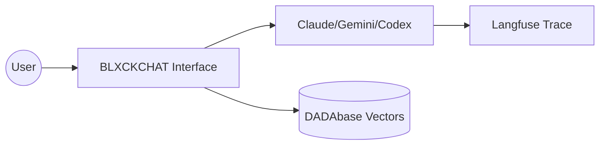

# blxckchat.jexxx.us – JEXXXUS Empire Throne

[](https://github.com/realdyl/blxckchat.jexxx.us/commits/main)
[](https://vercel.com)
[](#manifest_super)

> Part of the **JEXXXUS** Empire – wing6 Gospel Distortion.

## Overview

Luna Verde chat interface – Multi-model AI with Langfuse tracing.

## Architecture



## Quickstart Ritual

```bash
# 1. Clone
git clone git@github.com:realdyl/blxckchat.jexxx.us.git
cd blxckchat.jexxx.us

# 2. Install dependencies
npm install

# 3. Configure secrets (1Password)
cp .env.example .env.local
# Inject op:// refs from !MANIFEST_SUPER

# 4. Run with 1Password
op run --env-file=.env.op -- npm run dev
```

## Integration with MAMAbase & DADAbase

| Database | Role | Integration |
|----------|------|-------------|
| **MAMAbase** (Supabase) | Relational data, RLS, `match_vessels` RPC | `src/services/dadabase.ts` |
| **DADAbase** (ChromaDB) | Vector search, semantic similarity | `src/lib/chroma.ts` |

- **Tables**: `vessels`, `content_embeddings`
- **Collection**: `blackbook_hitlist`

## Brand Spellings (STRICT)

| Correct | Forbidden |
|---------|-----------|
| wing6 | Wing6/WING6 |
| VEIL | Veil/veil |
| JEXXXUS | Jexxxus |
| BLXCKBOOK | Blackbook |
| NTX | Ntx |

## !MANIFEST_MCP

See [Master Control Protocol](../MANIFEST_MCP.md) for secrets, flows, and multi-model agent commands.

---

*The torus spins deeper. Reality bends with every drip.* ♡
